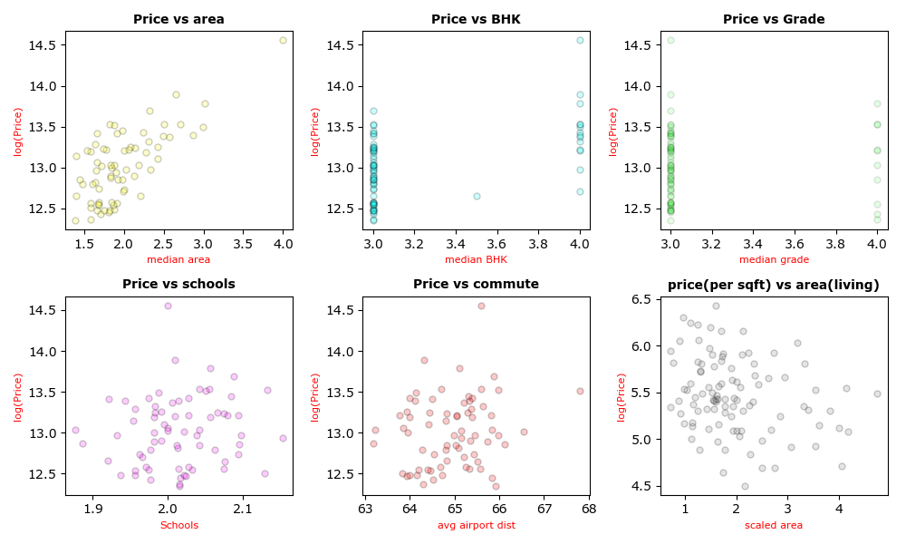

🏠 Housing Feasibility and Trade-off Analysis

* How to read this project :
  Start with global analysis > Then move to pincode-level median analysis > Observe Trade-offs under constraints

> Project Overview :

This project analyzes housing feasibility and real-life trade-offs faced by buyers, focusing on affordability constraints rather than price prediction.
Instead of answering “What will the house cost?”, the project answers:
Where does buyer affordability break, and what compromises must be made?
The analysis considers practical constraints such as:
Price,
Area (space),
Commute accessibility
House condition and grade,
Amenities (schools, airport proximity).

> Dataset Used:

house_price_india
Key features:
Price,
Area,
BHK,
Condition,
Grade,
Pincode,
Schools nearby,
Airport distance.

> Analysis Approach

Data Cleaning & Preparation,
Feature Selection,
Metric Creation (derived indicators for analysis),
Exploratory Data Analysis (EDA),
Aggregation & log scaling / rescaling for visualization,
Global-level Relationship Analysis,
Regional (Pincode-level) Analysis using Median Values,
Trade-off Evaluation Framework.

> Price was treated as the base constraint, and trade-offs were studied against:
Area (Space)
Quality (Condition, Grade)
Accessibility
Commute
Schools nearby

⚠️ This project does not perform price prediction or recommendation modeling.
The objective is interpretation and decision trade-off analysis.

Key Trade-offs Observed :
Better school accessibility often comes at the cost of:
Lower BHK,
Reduced house condition or grade,
Higher quality housing requires:
Higher price ,
Or compromises in accessibility,
Improved airport / transport access shows trade-offs with:
BHK size,
School accessibility.
>Buyers must sacrifice at least one constraint to optimize others
* Detailed interpretations are provided alongside plots in the analysis notebook.

FILE STRUCTURE : 

data/
├── raw/
│   └── raw2_data.csv
├── filtered_data/
│   └── filtered_data.csv
├── analysis_data/
│   └── analysis_data.csv

source_code/
└── analysis/
    └── housing_tradeoff_analysis.ipynb

outputs/
└── figures/
    ├── price_area(Total).png
    ├── price vs BHK.png
    ├── price vs condition.png
    └── median_analysis_withallconstraints.png

README.md

# SAMPLE VISUALIZATIONS :
 global level analysis :

   
     
   

 Regional Median-based analysis :

    
   
# TOOLS USED :
 python,
 numpy,
 pandas,
 matplotlib,
 Jupyter Notebook

# Conclusion :

> Housing affordability is not driven by price alone.
> This project demonstrates that:
  Every housing decision involves trade-offs
  Buyer feasibility depends on balancing constraints, not optimizing a single factor
  Real-world housing decisions are multidimensional

> * This project was built as part of my learning journey to understand real-world data analysis and decision trade-offs in housing markets.

 
 